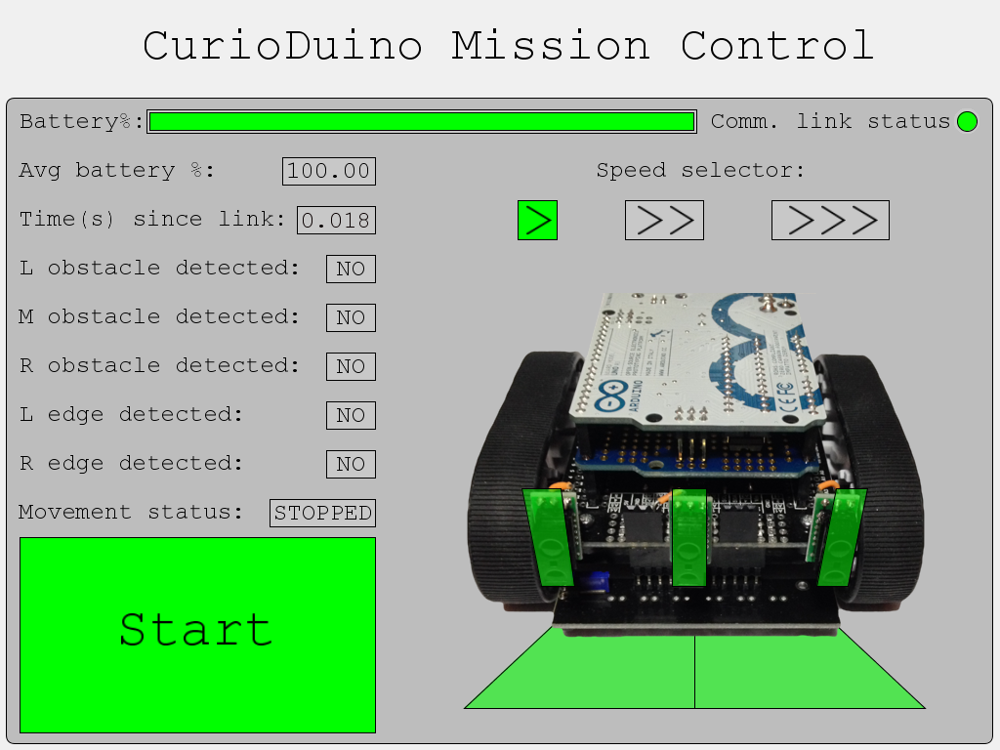

CurioDuinoGUI
=============
A graphical interface in Processing for the CurioDuino robot. 

This GUI interfaces with the CurioDuino On Board Software - http://github.com/davidskeck/CurioDuinoOBS - an autonomous robotics software for Arduino in an RTOS.

Instructions
============
Keyboard shortcuts:

Start/Stop: Spacebar

Speed One : 1

Speed Two : 2

Speed Three: 3

Update the PORT_NUMBER constant at the top of the main processing sketch to indicate what port your CurioDuino or other robot is on. Then run the sketch normally.

Further reading
===============
More information about this project is available here: http://davidskeck.wordpress.com
